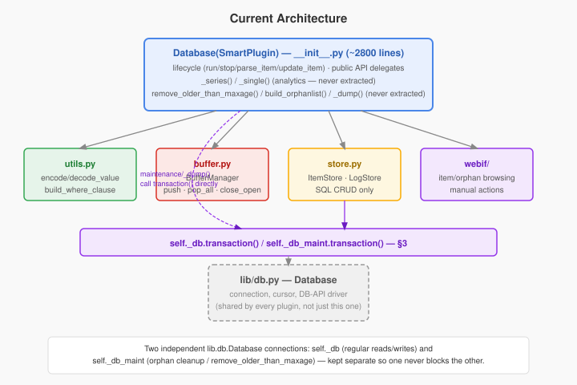
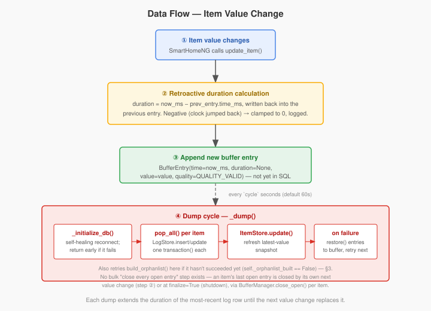
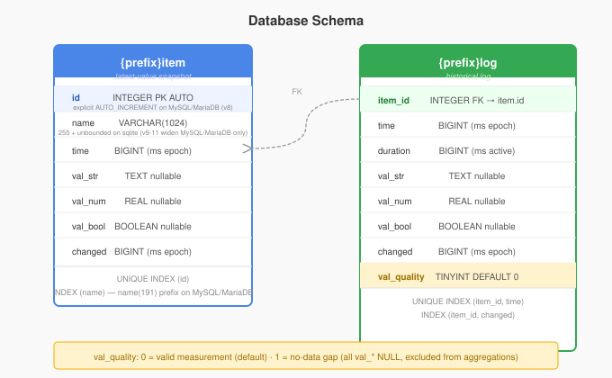
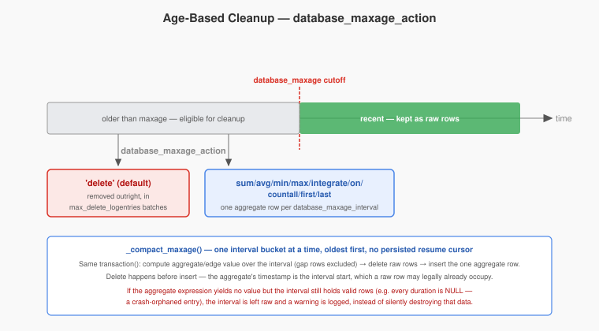

# SmartHomeNG Database Plugin — Developer Documentation

This document describes the internal design of the `database` plugin and the connection/locking
primitive it builds on (`lib/db.py`'s `Database` class). It is aimed at Python developers who are
already familiar with SmartHomeNG basics.

> **Status (verified 2026-08-23 against `plugins/database/` and `lib/db.py` on
> `database-transaction-refactor` / `db-transaction-refactor`):** Describes the system as it exists
> today. The plugin went through a module split (`utils.py`/`buffer.py`/`store.py` extracted from
> `__init__.py`) and, separately, a locking rewrite that replaced hand-rolled
> `lock()`/`cursor()`/`commit()`/`rollback()`/`release()` sequences throughout both `lib/db.py` and
> the plugin with a single `transaction()` context manager. Both are complete and are described
> below as the current design, not as proposals. For the history of *why* — the incidents that
> motivated the locking rewrite, and the two audit passes that followed it — see this project's
> commit history; this document does not attempt to be a changelog.

---

## 1. Overview

The `database` plugin persists item values to a relational database (SQLite or MySQL/MariaDB via
`lib/db.py`; other DB-API 2 drivers work if `lib/db.py`'s type-conversion tables are extended for
them). Its distinguishing feature compared to a plain event log is that **every row records not
just a value but how long that value was active** — the `duration` column. This makes it
straightforward to compute time-weighted averages, cumulative energy totals, and similar analytics
directly in SQL.

Five concepts are central to understanding the plugin:

| Concept | Description |
|---|---|
| **log table** | The historical record. One row per value-change event, with `time`, `duration`, and the value itself. |
| **item table** | A single-row-per-item snapshot of the *latest* value. Used for fast lookups without scanning the log. |
| **buffer** | An in-memory dict (keyed by item id) that accumulates incoming changes between database writes. |
| **dump cycle** | A scheduler job that runs every `cycle` seconds (default 60) and flushes the buffer to SQL in one transaction. |
| **transaction()** | `lib/db.py`'s locking primitive — acquires the connection's lock, yields a cursor, commits on success or rolls back on exception, always releases. Almost every multi-statement DB access in the plugin goes through it. |

---

## 2. Architecture

```
plugins/database/
├── __init__.py    # Database(SmartPlugin) — plugin lifecycle, public API,
│                  #   _series()/_single() (analytics), remove_older_than_maxage()/
│                  #   build_orphanlist() (maintenance), _dump() (scheduler callback)
├── utils.py       # Pure functions, no side effects, no DB connection needed
├── buffer.py      # BufferManager — owns the in-memory buffer dict + its lock
├── store.py       # ItemStore + LogStore — SQL CRUD against {item}/{log}
├── constants.py   # BufferEntry namedtuple, QUALITY_VALID/QUALITY_NO_DATA, column indices
└── webif/         # Web interface (item/orphan browsing, manual actions)
```



`_series()`/`_single()` (on-demand analytics for the websocket plugin and logics) and
`remove_older_than_maxage()`/`build_orphanlist()` (scheduled maintenance) were originally planned
to move into their own `query.py`/`maintenance.py` modules. That split was never done — they remain
methods on `Database` in `__init__.py`, which at ~2800 lines is still the largest file in the
plugin. Nothing about correctness depends on this; it is a maintainability trade-off, not a design
constraint.

**`utils.py`** — pure functions, importable without any database connection:

- `encode_value(item_type, value) -> dict` — maps a Python value to the three SQL columns (`val_str`/`val_num`/`val_bool`).
- `decode_value(item_type, val_str, val_num, val_bool) -> value` — reverse.
- `to_timestamp(dt) -> int` / `from_timestamp(ts, tzinfo=None) -> datetime` — ms-since-epoch conversion.
- `apply_table_names(query, table_names) -> str` — substitutes `{item}`/`{log}`/`{item_columns}`/`{log_columns}` placeholders.
- `build_where_clause(item_id, *, time=None, time_start=None, ..., exclude_gaps=False) -> (sql, params)` — builds a parameterised `WHERE` clause. `exclude_gaps` is opt-in — see §6.

**`buffer.py`** — `BufferManager`:

- Owns `self._buffer: dict` and its lock; `register()`/`deregister()` manage item lifecycle.
- `push(item, entry)` — appends a `BufferEntry`.
- `close_open(item, end_ts)` / `set_last_duration(item, duration)` — back-fill the duration of the last open (`duration=None`) entry, per item (there is no bulk "close everything" call — see §4).
- `push_invalid(item, start_ts)` — opens a `QUALITY_NO_DATA` gap entry (§6).
- `pop_all(item)` / `restore(item, entries)` — drain an item's pending writes for `_dump()`, and put them back if the write fails.

**`store.py`** — `ItemStore` and `LogStore`, both stateless wrappers around a `lib.db.Database`
connection and a `table_names` dict, no plugin business logic:

- `ItemStore`: `insert`, `update`, `find`, `find_all`, `count`, `delete`.
- `LogStore`: `insert`, `update`, `upsert`, `find`, `find_range`, `count`, `count_all`,
  `delete_range`, `oldest_time`, `latest_time`, `edge_value`, `aggregate`.

**`__init__.py`** — `Database(SmartPlugin)`:

- Creates and wires `BufferManager`/`ItemStore`/`LogStore`, plus two independent `lib.db.Database`
  connections: `self._db` (regular reads/writes) and `self._db_maint` (maintenance —
  orphan cleanup, `remove_older_than_maxage()`). Kept separate so a long-running maintenance
  transaction never blocks ordinary item logging, and vice versa.
- Implements `run`/`stop`/`parse_item`/`update_item`/`_dump` and re-exports every legacy method
  name (`insertLog`, `readItem`, `insertItem`, ...) as a one-line delegate to the store objects —
  the public API used by items, the web interface, and user automations is unchanged by any of the
  above.

---

## 3. Locking and Transactions

`lib.db.Database` (`lib/db.py`) is a thin wrapper around a DB-API 2 connection, shared by every
plugin that needs SQL access. Its central primitive is `transaction()`:

```python
with self._db.transaction() as cur:
    self._log_store.insert(item_id, entry, item_type, now_ms, cur=cur)
    self._item_store.update(item_id, entry, cur=cur)
```

`transaction()` acquires the connection's lock, yields a cursor, commits on clean exit, rolls back
on any exception (re-raising it), and always releases the lock — regardless of which path was
taken. This replaced a large number of hand-rolled `lock()`/`cursor()`/`commit()`/`rollback()`/
`release()` sequences scattered across the plugin, several of which had real gaps: statements
running with no lock at all, writes left uncommitted on the `cur=None` path, and failures that
didn't roll back and so left a corrupted connection for the next caller.

**Two rules that matter for anyone adding a new call site:**

- `self._fdb_lock` is a plain, non-reentrant `threading.Lock`, held for the *entire* `transaction()`
  block. It cannot be nested, and nothing invoked from inside the block may acquire the lock again
  itself — a `cur=None` call to `execute()`/`fetchone()`/`fetchall()`, or `connect()`/`close()`/
  `verify()`/`setup()`, all hit the same lock. `lock()` detects same-thread re-entry and raises
  `RuntimeError` immediately instead of deadlocking. Always pass the yielded `cur` through
  explicitly to every statement run inside the block.
- `cur=None` means "acquire your own lock and commit as a self-contained unit" (typically via an
  internal `transaction()` call). An explicit `cur` means "the caller already holds the lock and
  owns the commit/rollback decision" — the callee must never call `commit()`/`rollback()` itself.
  These are the only two supported shapes; a caller-selectable "commit anyway" flag independent of
  whether `cur` was passed is exactly the pattern that caused several of the bugs `transaction()`
  replaced, and should not be reintroduced.

**Self-healing reconnect.** Every entry point that touches the database (`id()`, `_dump()`,
`_query()`, `run()`) calls `_initialize_db()` first, which attempts to (re)connect if not already
connected, throttled to one real attempt per 20 seconds. None of them crash or exit the plugin on
failure — they log and return a "no data"/`False` result, and the *next* call retries. `verify()`
additionally does an active connectivity probe with its own short timeout, used before trusting an
already-`connected()` socket that may have gone stale server-side.

One consequence worth knowing: `build_orphanlist()` (used by the web interface's orphan list and by
`remove_orphan_items()`) is only ever *triggered* once at startup (`run()`) and, if that attempt
fails because the DB wasn't connected yet, once more per `_dump()` cycle until it succeeds —
piggybacked on the cycle that's already running rather than a separate retry loop.
`self._orphanlist_built` tracks whether it has ever completed successfully; an empty
`self.orphanlist` alone does not mean "confirmed no orphans" — it can also mean "haven't been able
to check yet".

---

## 4. Data Flow

This section traces what happens when an item value changes.



1. **Item changes.** SmartHomeNG calls `Database.update_item(item, caller, source, dest)`. The
   method checks whether the item has the `database` attribute and bails out early if not.

2. **Duration is calculated retroactively.** The database does not know in advance how long a value
   will be active. When a *new* value arrives, the plugin looks up the previous buffer entry for
   this item and computes `duration = now_ms - prev_entry.time_ms`, writing that duration back into
   the previous (now-closed) entry. A duration that comes out negative (system clock jumped
   backward — NTP correction, DST, VM resume) is clamped to `0` and logged, rather than corrupting
   time-weighted aggregates with a negative value.

3. **New buffer entry appended**, with `duration=None` — "this value is still active, duration not
   yet known": `BufferEntry(time=now_ms, duration=None, value=value, quality=QUALITY_VALID)`.

4. **Dump cycle.** Every `cycle` seconds (default 60) the scheduler calls `Database._dump()`, which:

   a. Calls `_initialize_db()` — self-healing, see §3. Returns immediately if that fails; buffered
      entries stay buffered for the next cycle.

   b. If `self._orphanlist_built` is still `False`, retries `build_orphanlist()` (see §3).

   c. For each item with pending entries, calls `BufferManager.pop_all(item)` to drain them
      atomically, then `LogStore.insert`/`LogStore.update` inside one `self._db.transaction()`
      block per item.

   d. Calls `ItemStore.update` to refresh the latest-value snapshot.

   e. If a write fails, the popped entries are restored to the buffer (`BufferManager.restore()`)
      for the next cycle rather than being dropped.

There is no bulk "close every open entry" pass — the still-open (`duration=None`) most recent entry
for an item is closed the next time that specific item changes, or at `finalize=True` (plugin
shutdown), via `BufferManager.close_open()`/`set_last_duration()` operating per item.

---

## 5. Database Schema

The plugin manages two tables, named via `db_prefix` (default `log` and `item`), created and
migrated by `lib.db.Database.setup()` against a versioned `_setup` dict — each version is one
forward-only DDL statement, applied in ascending numeric order to any install below that version on
every startup. Current version: **11**.

### `{prefix}item` — latest-value snapshot

```sql
CREATE TABLE {item} (
    id       INTEGER PRIMARY KEY [AUTO_INCREMENT on MySQL/MariaDB],  -- v2, retrofitted v8
    name     VARCHAR(1024),   -- VARCHAR(255) on sqlite (no length ever enforced there); v9-11 on MySQL/MariaDB
    time     BIGINT,          -- ms since epoch of last change
    val_str  TEXT,
    val_num  REAL,
    val_bool BOOLEAN,
    changed  BIGINT           -- ms since epoch of last write
);
CREATE UNIQUE INDEX {item}_id   ON {item} (id);
CREATE INDEX        {item}_name ON {item} (name(191) on MySQL/MariaDB, full column on sqlite);
```

One row per tracked item. `id` is database-generated (bare `INTEGER PRIMARY KEY` autoincrements
implicitly on sqlite via `rowid`; MySQL/MariaDB need the explicit `AUTO_INCREMENT`, added for fresh
installs in schema v2/v8 and retrofitted onto pre-existing installs by v8's `ALTER TABLE`).
`ItemStore.insert()` reads the new id back via the cursor's own `lastrowid`, not a follow-up query —
avoids the `MAX(id)+1` race a prior implementation had.

`name` is `varchar(255)` in the original schema and was never widened for MySQL/MariaDB until v9-11,
which is why the migration is a driver-gated no-op on sqlite and a real `ALTER TABLE` + index
rebuild elsewhere: MySQL/MariaDB reject item paths over 255 characters outright under strict SQL
mode, sqlite never enforced the length at all. The index is deliberately a `name(191)` *prefix*
index on MySQL/MariaDB rather than covering the full widened column — InnoDB's indexed-column byte
limit is charset/row-format dependent (767 bytes on older configurations, 3072 on modern ones), and
a 191-character prefix stays safely under the stricter limit regardless. A prefix index does not
affect the correctness of `WHERE name = ...` lookups, only how much of the value is used to narrow
candidate rows.

### `{prefix}log` — historical log

```sql
CREATE TABLE {log} (
    time         BIGINT,      -- ms since epoch when value became active
    item_id      INTEGER,
    duration     BIGINT,      -- ms the value was active
    val_str      TEXT,
    val_num      REAL,
    val_bool     BOOLEAN,
    changed      BIGINT,      -- ms since epoch of last write
    val_quality  TINYINT DEFAULT 0   -- v7, see §6
);
CREATE UNIQUE INDEX {log}_{item}_id_time    ON {log} (item_id, time);
CREATE INDEX        {log}_{item}_id_changed ON {log} (item_id, changed);
```

### Polymorphic value encoding

Each row stores a value in one of three typed columns:

| Item type | `val_str` | `val_num` | `val_bool` |
|---|---|---|---|
| `num` | NULL | the number | NULL |
| `bool` | NULL | 0 or 1 | 0 or 1 |
| `str` | the string | NULL | NULL |

`val_str = NULL` does **not** mean "no value was recorded" — it means the item is not a string
type. Aggregation queries must know the item's type to read the correct column.



---

## 6. Value Quality — No-Data Gaps

A device that goes offline (a solar inverter at night, a sensor that loses connectivity) leaves its
SmartHomeNG item holding its last known value indefinitely — items have no built-in concept of
"value expired", and setting `item(None)` is not a usable substitute (silently ignored or rejected
depending on item type). Left alone, the database would record that stale last reading as valid and
continuously active, corrupting any time-weighted average or energy calculation across the gap.

The `val_quality` column (schema v7) solves this:

| Value | Meaning |
|---|---|
| `0` (`QUALITY_VALID`) | Normal recorded value. |
| `1` (`QUALITY_NO_DATA`) | No data available — value should be ignored in aggregations. All `val_*` columns are `NULL`. |

The plugin injects two methods onto every tracked item:

```python
item.db_mark_invalid()   # opens a QUALITY_NO_DATA gap entry at the current time
item.db_mark_valid()     # explicitly closes an open gap
```

If a new value arrives via `update_item()` while a gap is still open, the gap is closed **implicitly** —
no explicit `db_mark_valid()` call is required. The typical driver usage is just:

```python
item.db_mark_invalid()          # device goes offline
item(new_value, 'driver')        # device comes back — gap closes automatically
```

Gap duration is calculated from the gap's own open timestamp, not the item's last regular
`prev_change()` — those can differ if the gap opened well after the last real value change. There is
no separate tracking dict for open gaps; state is read directly off `BufferManager`'s last entry for
the item (`duration is None and quality == QUALITY_NO_DATA`), so a redundant `db_mark_valid()` call
after the gap has already closed is a harmless no-op.


**Filtering gaps out of queries.** `utils.build_where_clause()` takes an `exclude_gaps` parameter,
opt-in rather than blanket:

- **On-demand analytics** (`_series()`/`_single()`, via `_fetch_log_base_where()`) always filter
  `(val_quality IS NULL OR val_quality = 0)` unconditionally — a gap row never contributes to a
  displayed series or a computed single value.
- **Compaction** (`LogStore.aggregate()`/`edge_value()`, used by `_compact_maxage()`, §7) passes
  `exclude_gaps=True` explicitly, for the same reason: a gap's `NULL` values must not corrupt the
  computed aggregate, and its (often large) duration must not skew a duration-weighted average.
- **Raw row management** (`delete_range()`/`find_range()`/`count()`) deliberately does *not*
  exclude gaps — a gap marker is still a real row that needs to be counted and cleaned up like any
  other, not silently skipped.

---

## 7. Age-Based Cleanup — Delete vs. Compact



Two independent, configurable mechanisms control how long log data is kept.

**`database_maxage`** (item attribute, in days) / **`default_maxage`** (plugin-level fallback for
items that don't set their own) — how old a log entry has to be before it's eligible for cleanup.
`default_maxage` alone (with no item setting its own `database_maxage`) is sufficient to activate
cleanup — the scheduler's worklist falls back to every item with a plain `database` attribute in
that case, not just ones with an explicit `database_maxage`.

**`database_maxage_action`** (item attribute) / **`default_maxage_action`** (plugin-level fallback)
— what happens to eligible entries. `'delete'` (the default) removes them outright, in
`max_delete_logentries`-sized batches per cycle so a very large backlog doesn't hold the lock for an
unbounded time. Any other value replaces raw entries with **one compacted value per
`database_maxage_interval`** instead of deleting them:

| Action | SQL expression | Valid item types |
|---|---|---|
| `sum` | `SUM(val_num)` | num, bool |
| `avg` | `AVG(val_num * duration) / AVG(duration)` | num, bool |
| `min` / `max` | `MIN(val_num)` / `MAX(val_num)` | num, bool |
| `integrate` | `SUM(val_num * duration)` | num, bool |
| `on` | `SUM(val_bool * duration) / SUM(duration)` | bool only |
| `countall` | `COUNT(*)` | any |
| `first` / `last` | oldest/newest raw value as-is (`ORDER BY time ASC/DESC LIMIT 1`) | any, including str |

A `database_maxage_action` invalid for the item's actual type (e.g. `sum` on a `str` item — `val_num`
is always `NULL` for strings) is rejected at `parse_item()` time with a logged error and falls back
to `'delete'` for that item. `first`/`last` work for every type because they read back whatever
`encode_value()` already stored, rather than computing anything over it — the only actions usable
for `str` items.

**Compaction (`_compact_maxage()`)** proceeds oldest-first, one `database_maxage_interval`-sized
bucket at a time, bounded by `max_aggregate_intervals` per call. There is no persisted resume
cursor — the next interval to compact is always simply whatever raw data remains oldest for that
item, so a crash or restart mid-compaction is self-healing by construction. Each interval's
aggregate/edge value is computed and its raw rows deleted inside the *same* `transaction()`
(`delete_range()` does **not** exclude gaps here — see §6 — a gap row is still deleted alongside
whatever real data shares its interval, since it contributed nothing to the aggregate but is still a
row to clean up). Delete happens before insert, not after: the aggregate row's timestamp is derived
from the oldest raw row's own timestamp, so inserting first risks colliding with it under the
`(item_id, time)` unique index.

If an interval's aggregate expression produces no value at all (e.g. every row in it has
`duration = NULL` — a crash-orphaned, never-closed buffer entry that reached the log table without
ever going through `_dump()`'s normal duration-fill) but the interval genuinely contains valid rows,
compaction leaves that interval raw rather than deleting data it cannot represent, logs a warning,
and stops for that item — it does not skip past the stalled interval to keep compacting newer ones,
since that would silently reorder which data survives.

---

## 8. Further Reading

- `lib/db.py`'s own module docstring and `Database.transaction()`'s docstring cover connection-level
  concerns (reconnect throttling, the hang watchdog, self-healing `commit()`/`rollback()`) not
  repeated here since they apply to every plugin using `lib/db.py`, not just this one.
- This plugin's `user_doc.rst` covers end-user configuration, including the MySQL/MariaDB-specific
  limits mentioned in §5/§7.
- For *why* the locking model looks like this — the production incidents and the two audit passes
  that shaped it — see the project's commit history on the `db-transaction-refactor` /
  `database-transaction-refactor` branches; this document intentionally describes the current
  design only, not that process.
