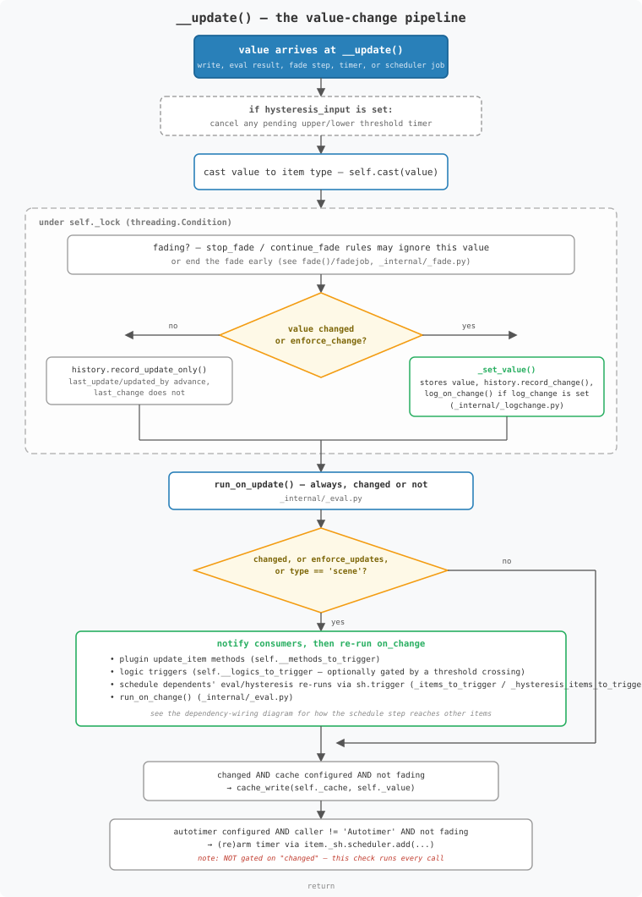
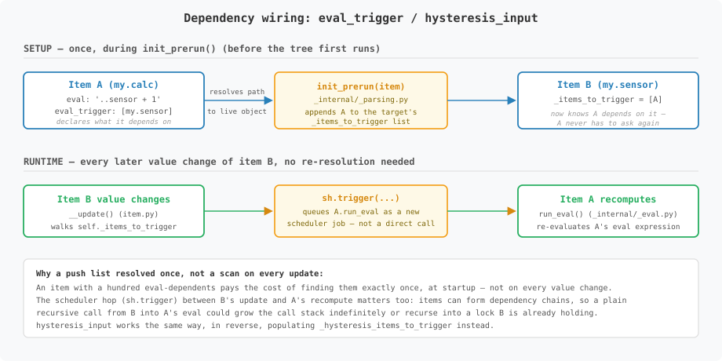

# `Item` and `Items` — How They Actually Work

This describes the two classes in `lib/item/` that make up SmartHomeNG's item
system: `Item` (one node in the item tree) and `Items` (the tree as a whole).
It's written for a maintainer who knows Python and has configured items and
their attributes before, but hasn't looked inside `lib/item/` yet. It
explains the mechanics — construction, value updates, how items come to
depend on each other — rather than listing class members; for that, see the
autodoc-generated API reference.

Most of `Item`'s logic doesn't literally sit in `lib/item/item.py`: it's
spread across single-purpose modules under `lib/item/_internal/`, called
with the `Item` instance passed in explicitly. That split is a code
organisation detail (see [`lib_item_refactoring.md`](lib_item_refactoring.md)
for why and how) and doesn't change anything described below — where it's
useful to know which file a piece of behaviour lives in, this document names
it as `function()` (`file.py`), e.g. `run_eval()` (`_internal/_eval.py`).

## The two classes, in one sentence each

- **`Item`** is one node: it holds a value, its type, its parsed
  configuration, its change history, and the logic for reacting to a new
  value.
- **`Items`** is the tree: exactly one instance exists per running
  SmartHomeNG process, and it owns the path → `Item` registry, loads item
  definitions from YAML at startup, and handles runtime creation, editing,
  renaming, copying and removal of items.

Every `Item` is created with a reference to the single `Items` instance and
registers itself there as soon as it exists; nothing about an item is usable
before that registration has happened.

## Building the tree

At startup, `Items.load_itemdefinitions()` first loads struct definitions
(reusable attribute templates, handled by a separate `Structs` helper — not
covered here) and then parses the `items/` directory into one big nested
`dict`, where each nested `dict` value represents a child item. Struct
references are expanded into that `dict` at this stage too, by `lib.config`
— by the time an `Item` is constructed, a `struct:` reference has already
become the plain attributes it stood for, and `Item` never has to know
structs exist at all. For each top-level entry, `load_itemdefinitions()`
calls `_construct_and_link()`, which constructs an `Item` and links it under
its parent (or under the `Items` instance itself, for a top-level item).

The recursion isn't in `Items` — it's in `Item.__init__()` itself. While
building itself from its config `dict`, an item walks that same `dict` a
second time looking for nested `dict` values, and constructs a child `Item`
for each one it finds:

```python
for attr, value in config.items():
    if isinstance(value, dict):
        child = Item(smarthome, self, child_path, value)
        ...
        _items_instance.add_item(child_path, child)
        self.__children.append(child)
```

So the whole subtree under a top-level item is built and registered
depth-first in one constructor call, before `_construct_and_link()` even
returns.

Once every item in the configuration exists, `Items` runs three passes over
the *entire* tree, in order:

1. `_init_prerun()` — wire up cross-item dependencies (see below).
2. `_init_start_scheduler()` — start scheduler jobs for items with a
   `crontab` or `cycle` attribute.
3. `_init_run()` — run the initial `eval` for items that have one and need
   it (skipped if the item already got its value from cache).

These are three separate passes over *all* items, not folded into
construction, specifically so that an item's `eval_trigger` can name another
item defined later in the YAML tree — by the time pass 1 runs, every item
already exists, so forward references resolve correctly.

## Reading and writing a value: `__call__`

An item is called like a function, and the same call means "read" or
"write" depending on whether an argument is given: `sh.some.item()` reads,
`sh.some.item(42)` writes.

Reading returns a `copy.deepcopy()` of the current value (so callers can't
mutate a `list`/`dict` item's internal state by holding a reference to what
they read) — or, for `dict`/`list` items, `key=`/`index=` shortcuts into
`__get_dictentry()`/`__get_listentry()`.

Writing is where it gets interesting: if the item has an `eval` attribute,
calling it with a value does **not** store that value directly. It queues a
re-run of the item's own eval expression instead:

```python
if self._eval:
    args = {'value': value, 'caller': caller, 'source': source, 'dest': dest}
    self._sh.trigger(name=self._path + '-eval', obj=self.__run_eval, value=args, ...)
else:
    self.__update(value, caller, source, dest, key, index)
```

A computed item is computed — "setting" it is really "ask it to
recompute, with this as the incoming `value`". Only items *without* an
`eval` go straight to `__update()`.

## `__update()` — the value-change pipeline

`__update()` (`item.py`) is the one place a value actually lands on an item,
whether it got there from a plain write, from an eval result via
`run_eval()` → `_update_item()`, or from a hysteresis/on_change/on_update
handler. Roughly, in order (see the diagram below for the full branching):

1. If the item is a **hysteresis** item, any pending upper/lower threshold
   timers are cancelled first — a new value always takes precedence over a
   timer that was waiting to fire.
2. The value is **cast** to the item's type (`self.cast`, resolved once per
   item in `_apply_config()` — see below).
3. Under `self._lock` (a `threading.Condition`): if the item is
   **fading**, the new value may be ignored, or may stop the fade,
   depending on the `stop_fade`/`continue_fade` attributes. Otherwise, if
   the value actually changed (or `enforce_change` is set), `_set_value()`
   records it — updates `self._value`, the change history, and runs
   `log_on_change()` (`_internal/_logchange.py`) if `log_change` is
   configured; if it didn't change, only the update-side history advances.
4. `run_on_update()` (`_internal/_eval.py`) always runs, changed or not.
5. **Only if the value changed** (or `enforce_updates`/type `scene`):
   - every plugin `update_item` method registered on this item runs
     (`self.__methods_to_trigger`, see below),
   - every logic registered on this item fires (`self.__logics_to_trigger`,
     optionally gated by a `threshold` crossing),
   - every item that depends on *this* item's value gets its own
     eval/hysteresis re-run **scheduled**, not called directly (see next
     section),
   - `run_on_change()` (`_internal/_eval.py`) runs.
6. If a `cache` file is configured **and** the value changed, the cache
   file is rewritten.
7. Separately — and *not* conditional on the value having changed —
   if `autotimer` is set and this call didn't itself come from the
   autotimer firing, its timer is (re)armed against the freshly-written
   value. An autotimer stays armed across same-value updates on purpose:
   it resets its own countdown on any incoming write, not only on ones
   that changed something.



The reason step 5's cross-item re-runs go through `self._sh.trigger(...)`
(SmartHomeNG's scheduler queue) instead of a direct function call matters:
items can depend on each other in chains or even cycles, and a plain
recursive call would grow the call stack and could recurse into the same
item's lock. Scheduling the re-run instead hands it to the scheduler as a
new unit of work, decoupling one item's update from the next one it
triggers.

## How items come to depend on each other

An item's `eval_trigger` (or `trigger`) attribute names other items' paths;
its `hysteresis_input` names one. These aren't resolved every time a value
changes — they're resolved exactly once, during the `_init_prerun()` pass
described above, into direct object references stored on the *other*
item(s):

```python
# init_prerun(), _internal/_parsing.py — item is the one declaring eval_trigger
for triggered in _items:          # the items named in item._trigger
    if triggered != item:
        triggered._items_to_trigger.append(item)
```

So `_items_to_trigger` on an item is the list of *other* items whose eval
depends on this one; when this item's value changes, `__update()` walks that
list and schedules each dependent's `run_eval()`. `hysteresis_input` works
the same way in reverse, populating `_hysteresis_items_to_trigger`. This is
a push model set up once at startup, not a scan performed on every value
change — an item with a hundred eval-dependents pays for that fan-out once,
at load time, not on every update.



The same pass also handles the small set of "magic" `eval` shorthands —
`and`, `or`, `sum`, `avg`, `max`, `min` — by rewriting `item._eval` from the
keyword into an actual Python expression over its trigger items, e.g. `sum`
over items `a` and `b` becomes the string `"sh.a() + sh.b()"` before it's
ever handed to `eval()`.

## One write path, many entry points

Regardless of where a new value comes from, it always ends up going through
`__call__()` → `__update()` — nothing mutates `self._value` directly from
outside that path, even where it might look like it does:

- **`item.list.append(v)` / `item.dict.update(...)`** — `item.list` and
  `item.dict` are `ListHandler`/`DictHandler` instances
  (`_internal/_typehandler.py`), attached as attributes in `__init__` only
  for items of the matching type. Every one of their methods deep-copies the
  current value, applies the requested mutation to the copy, and calls
  `item.__call__()` with the result — so a list/dict mutation still goes
  through casting, history, and every trigger, exactly like a plain write.
- **Fade**: `fade()` (`_internal/_fade.py`) validates its parameters, stores
  them on `item._fadingdetails`, and schedules `fadejob()` (`helpers.py`)
  once via `item._sh.trigger()`. `fadejob` then drives itself: each step it
  computes the next value, calls `item(fade_value, 'Fader', ...)` — back
  through `__call__()` — and waits on `item._lock` for the step interval,
  until the target is reached or `__update()`'s `stop_fade`/`continue_fade`
  handling (described above) tells it to stop.
- **Timers and autotimer**: `timer()`/`autotimer()` (`_internal/_autotimer.py`)
  don't set a value immediately — they register a one-shot job with
  `item._sh.scheduler.add(..., item.__call__, value={'value': ..., 'caller':
  'Timer'/'Autotimer'}, next=<time>)`. When the scheduler fires later, it
  simply calls the item, the same as any other caller would.
- **`cycle` / `crontab`**: registered once at startup by
  `init_start_scheduler()` (the second of the three startup passes), the
  same way — the scheduler's job target is the `Item` object itself.

The common thread: whatever decides *that* a value should change — a
plugin, a logic, an eval result, a fade step, a fired timer, a cron
schedule — hands that decision to `__call__()`/`__update()` rather than
poking `_value` itself. Casting, history, logging, and every trigger
described above happen exactly once, in exactly one place, no matter which
of these paths got there.

## Composed helper objects: `Property` and `ItemHistory`

Two small objects live inside every `Item`, both created once in
`__init__()`, each owning one narrow slice of an item's shape:

- **`self.property`** is a `Property` instance (`property.py`). It exists
  to give external code — plugins, logics, shngadmin's backend — one
  designated, read-only surface for an item's publicly-supported metadata
  (`item.property.path`, `.type`, `.attributes`, and more), instead of
  reaching into `Item`'s own attributes, which mix genuinely public state
  with internal bookkeeping under inconsistent naming. Every property on it
  is deliberately read-only: an attempt to set one goes through
  `Property._ro_error()`, which logs and refuses rather than silently
  accepting a value the rest of `Item` would never see or act on.
- **`self._history`** is an `ItemHistory` instance
  (`_internal/_history.py`), created once with the item's initial timestamp
  and never replaced. It tracks four independent timelines — change,
  update, trigger, and value — each as a last/previous pair plus who caused
  it (`_last_change`/`_prev_change`/`_changed_by`/`_prev_change_by`, and
  the same shape for update/trigger). `_set_value()` calls
  `record_change()` on every actual value change; `__update()` calls
  `record_update_only()` when a value arrives but doesn't differ from the
  current one, so `last_update`/`updated_by` still advance even though
  `last_change` doesn't; `run_eval()` (`_internal/_eval.py`) calls
  `record_trigger()`. That distinction is exactly what lets `on_update`
  fire on every incoming write while `on_change` fires only on ones that
  actually changed the value — `ItemHistory` is the bookkeeping that tells
  those two cases apart.

## Attribute parsing: `_apply_config()`

`_apply_config()` (`item.py`) is the single place YAML attributes turn into
an item's runtime state. It's called from two places: once from
`__init__()` when an item is first built, and again from `Items.edit_item()`
when an item's configuration is changed at runtime — the same parsing logic
either way, so there's exactly one implementation to keep correct, not two
that can drift apart.

It starts by resetting every config-derived attribute to its default —
deliberately *not* touching the current value, history, children, lock, or
identity (path/parent), since an edit should be able to change, say,
`log_change` without resetting the item's value. Then it walks the config
`dict` attribute by attribute. Simple attributes (`name`, `type`, `cache`,
`crontab`, …) are cast and assigned directly; anything with real parsing
logic delegates to a dedicated function in `_internal/_parsing.py` — `eval`
to `_parse_eval_attribute()`, the `on_change`/`on_update` lists to
`_parse_on_xx_list_attribute()`, and so on. A parsed attribute typically
keeps both a resolved form (used at runtime) and an `_unexpanded` form (used
to redisplay the original configuration, e.g. in shngadmin's item editor).

One detail worth knowing if you ever touch type casting: the per-item
`self.cast` function is picked up via `globals()['cast_' + self._type]` —
a live lookup into `item.py`'s module namespace, which works because all the
`cast_*` functions are imported by name from `helpers.py` at the top of the
file. That's the same pattern the refactoring's `_casting.py` module
deliberately moved *away from* internally (replacing it with an explicit
dict) — but this particular lookup was left as-is, since it's a one-line
dispatch on a fixed, well-known set of type names, not the kind of thing
that benefits from the extra indirection.

## `Items`: registry, loader, and runtime CRUD

Only one `Items` instance is meant to exist per process; the constructor
logs a `critical` (with a stack trace of the caller) if a second one is
created. `Items.get_instance()` returns it via a module-level
`_items_instance` global in `items.py`; `item.py` keeps its own copy of the
same reference in a same-named global of its own, set explicitly the first
time an `Item` is constructed with an `items_instance` argument (falling
back to `smarthome.items` otherwise) — two globals in two files pointing at
the one object, not a shared variable.

Internally it's mostly two flat structures: `__items`, a list of every item
path, and `__item_dict`, a `path → Item` mapping. Every lookup — a single
item (`return_item()`), a path pattern (`match_items()`, regex over paths),
or a config-based search (`find_items()`) — goes through these, not through
walking the tree via parent/child links.

Beyond the initial load, `Items` is also the runtime API for changing the
tree while SmartHomeNG is running:

- **`create_item()`** does what `_construct_and_link()` does at startup,
  but for a single new (sub)tree at runtime — and, unlike startup, runs the
  three init passes immediately for just that subtree, since there's no
  batch of sibling items to wait for.
- **`edit_item()`** changes an existing item's attributes *in place*, via
  `_apply_config()`, instead of replacing the `Item` object. That matters
  because other items hold direct references to this item (in their
  `_items_to_trigger`, from the dependency wiring above) — replacing the
  object would mean finding and rewriting every one of those references.
  Mutating in place means they simply keep pointing at the same object,
  now with new behaviour.
- **`remove_item()`**, **`rename_item()`**, and **`copy_item()`** all have to
  deal with the fact that an item's path is also referenced as a *string* —
  inside other items' `eval`, `on_change`, `trigger`, `hysteresis_input`,
  etc. attributes, and inside the YAML files on disk. Object identity
  doesn't help there, since those references aren't Python references at
  all; nothing updates them automatically just because an `Item` object got
  renamed. This turns out to be the single largest block of code in
  `items.py` — roughly a dozen private helper methods
  (`find_references()`, `_rewrite_references()`, `_resolve_references()`,
  `_classify_relative_reference()`, and others alongside them) — but it's
  worth being clear about what kind of complexity it is: it's bookkeeping
  in support of tree-editing *operations*, not part of how a live `Item`
  computes or reacts to values. Understanding `__update()` and the
  dependency wiring above doesn't require understanding this machinery at
  all; it only matters if you're touching rename/copy/remove themselves.
  Two cases, in brief: a **rename** only ever has one item at the old path
  and one at the new path, so a matching string reference can simply be
  rewritten in place. A **copy** is harder, because both the original and
  the new copy now exist — an absolute `sh.<path>` reference gets rewritten
  automatically only if it pointed *inside* the copied subtree (so it now
  points at the copy, consistent with everything else that moved with it);
  a relative reference (`..sibling`) is never rewritten at all, only
  classified and flagged for the calling code to report, since what a
  relative reference resolves to depends on the path of the item that
  contains it — and that path just changed.

`Items` also owns two smaller registries worth knowing about:
`plugin_attributes`/`plugin_attribute_prefixes`, populated by
`add_plugin_attribute()`/`add_plugin_attribute_prefix()`, which is how a
plugin declares custom item attributes (or attribute-name prefixes) beyond
the core set `item.py` itself understands.

## Plugins and logics as consumers

When an item is constructed, every currently loaded plugin gets a chance to
look at it via `plugin.parse_item(item)`. If that returns a callable, it's
registered as a method-trigger (`add_method_trigger()`,
`_internal/_triggers.py`) — that callable is what step 5 of `__update()`
above calls on every future value change. This is how, for instance, a
KNX or MQTT plugin ends up being notified whenever an item it cares about
changes, without `Item` needing to know anything about KNX or MQTT.

Logics register interest the same way via `add_logic_trigger()`, and get
called from `__trigger_logics()` instead. Both trigger lists are plain
Python lists that can be mutated (by `add_*_trigger()`/`remove_*_trigger()`)
from any thread without a lock; the iteration in `__update()` takes a
`list(...)` snapshot first specifically so a concurrent registration or
removal can't raise a "list changed during iteration" error — it doesn't by
itself guarantee every add/remove is observed in exactly the update that
follows it.

## Concurrency, in short

`self._lock` (a `threading.Condition`) is held only around the
compare-and-set of the value itself and its history bookkeeping — not
around the trigger dispatch that follows. That's deliberate: plugin
callbacks, logic triggers, and scheduled cross-item re-runs can take an
unpredictable amount of time (a logic might do network I/O), and none of
that should hold up another thread that just wants to read or write the
item's current value.
