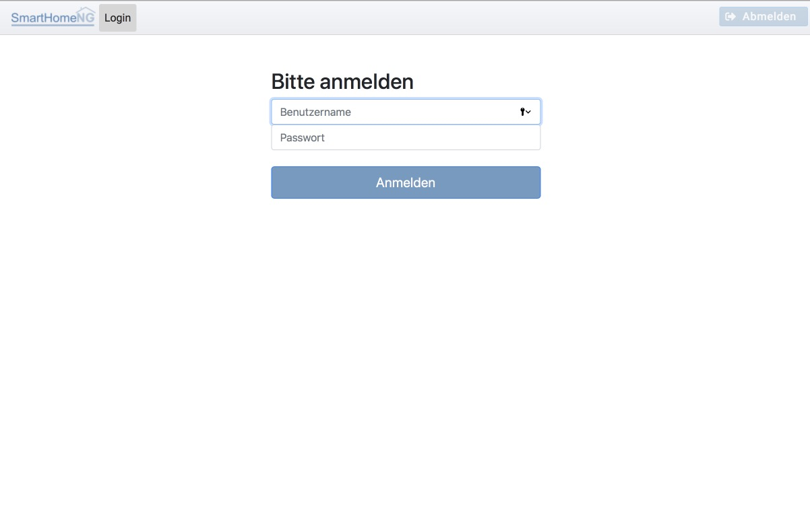
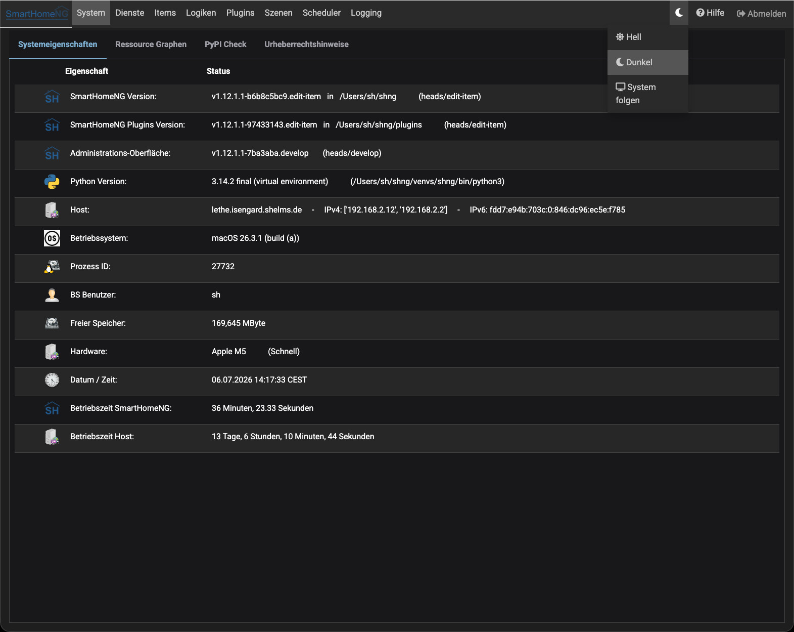

.. index:: Admin GUI
.. index:: Administrations-Interface
.. index:: Webinterfaces; Administrations GUI
.. index:: Webinterfaces; Administrations-Interface

.. role:: redsup
.. role:: bluesup
.. role:: darkbluesup
.. role:: greensup
.. role:: blacksup


Administrations-Interface
=========================

Seit SmartHomeNG v1.6 steht ein graphisches Administrations-Interface zur Verfügung, welches die vollständige
Administration von SmartHomeNG ermöglicht.

Das Administrations-Interface wird durch folgenden Aufruf gestartet:

.. code::

   http://<ip Ihres SmartHomeNG-Servers>:8383/admin


Über die Systemkonfiguration kann eingestellt werden, dass ```http://<ip Ihres SmartHomeNG-Servers>:8383```
automatisch auf das Administrations-Interface verweist.


Falls in der Konfiguration für das http Modul eine User/Passwort Kombination konfiguriert wurde, wird diese benötigt um
auf das Admin-Interface zuzugreifen:





Ansonsten wird direkt die Übersichtsseite der Systemeigenschaften angezeigt.

Wenn eine Anmeldung notwendig ist, so ist dieses nicht auf die Session beschränkt. Ein Beenden des Browsers meldet den
Anwender nicht ab. Hierzu muss der Abmelde-Button in der Navigation genutzt werden. Eine automatische Abmeldung erfolgt
nur, wenn das im Browser gespeicherte Token abläuft. Die Lebensdauer des Token ist in der Systemkonfiguration im Tab
**Admin Modul** konfigurierbar.


.. toctree::
   :maxdepth: 4
   :hidden:
   :titlesonly:

   system
   dienste
   items
   logiken
   scheduler
   plugins
   scenes
   threads
   logs


.. index:: Hilfe
.. index:: Admin GUI; Hilfe

Hilfe
-----

Neben dem Abmelde-Button findet sich ein **Hilfe** Eintrag, der die zur aktuell angezeigten Seite passende
Dokumentation in einem neuen Tab öffnet.

Falls auf dem Server lokal gebaute Dokumentation vorliegt (``doc/user/build/html``), wird zusätzlich zur
offiziellen Online-Dokumentation ein Link auf die lokale Dokumentation angeboten. Falls SmartHomeNG bzw. die
Plugins auf einem anderen Branch als **master** laufen, wird zusätzlich ein Link auf die Dokumentation des
**develop**-Branches angeboten (nicht auf die Dokumentation des tatsächlich laufenden Branches — diese wird
per GitHub-Workflow ausschließlich aus dem develop-Branch generiert).


.. index:: Dark Mode
.. index:: Admin GUI; Dark Mode

.. _dark-mode-section:

Dark Mode
---------

Neben dem Hilfe-Eintrag findet sich ein Schalter, über den zwischen hellem und dunklem Farbschema der
Administrationsoberfläche wahlweise gewechselt werden kann. Ein Klick öffnet ein Menü mit drei Optionen:

- **Hell**: Immer helles Farbschema, unabhängig von den Systemeinstellungen des Browsers/Betriebssystems.
- **Dunkel**: Immer dunkles Farbschema.
- **System folgen**: Das Farbschema folgt automatisch der Einstellung des Betriebssystems bzw. Browsers
  (``prefers-color-scheme``) und wechselt auch live, wenn diese Einstellung während der Nutzung geändert wird.



Die getroffene Auswahl wird pro Browser lokal gespeichert und hat Vorrang vor allen anderen Einstellungen.
Wurde noch keine Auswahl getroffen, so richtet sich das Farbschema nach der Systemeinstellung des Browsers,
falls dieser das unterstützt. Nur falls auch das nicht möglich ist, wird ersatzweise der Server-seitige
Standardwert genutzt, der über den Parameter **dark_mode** im Admin Modul eingestellt werden kann (siehe
Abschnitt System Konfiguration, Tab Admin Modul).

.. note::

   Manche Browser bieten eine Einstellung an, mit der Webseiten grundsätzlich das Erkennen der
   System-Farbeinstellung verweigert werden kann (z.B. Firefox' **„Resist Fingerprinting“**). In diesem Fall
   wirkt die Option **System folgen** wie **Hell**, bis stattdessen ausdrücklich **Dunkel** ausgewählt wird.


