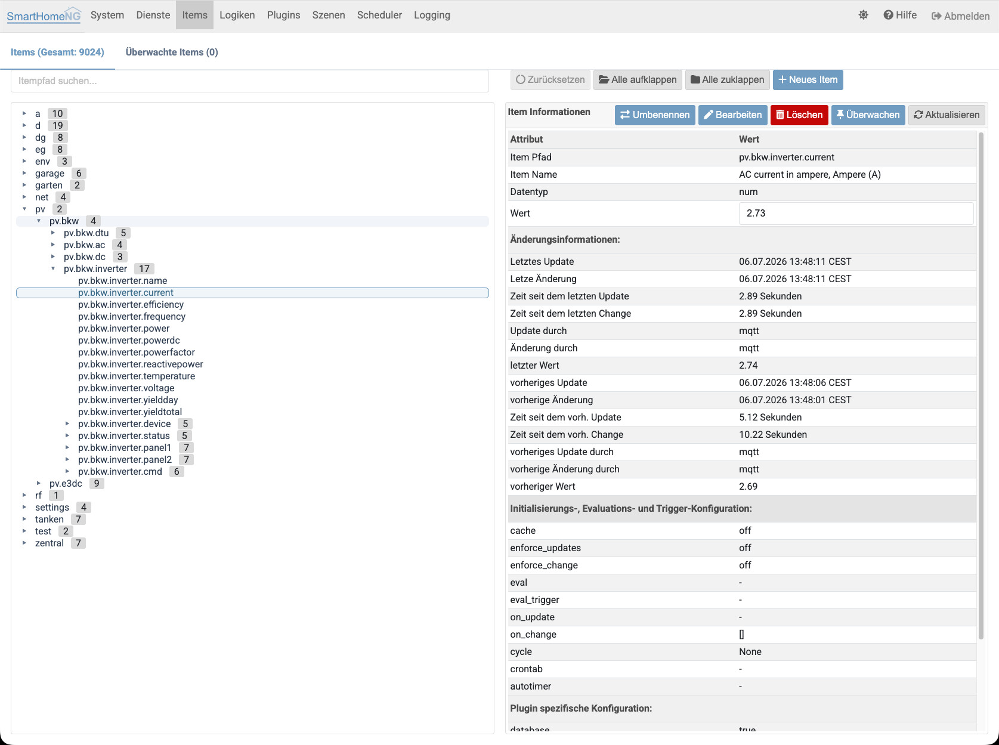
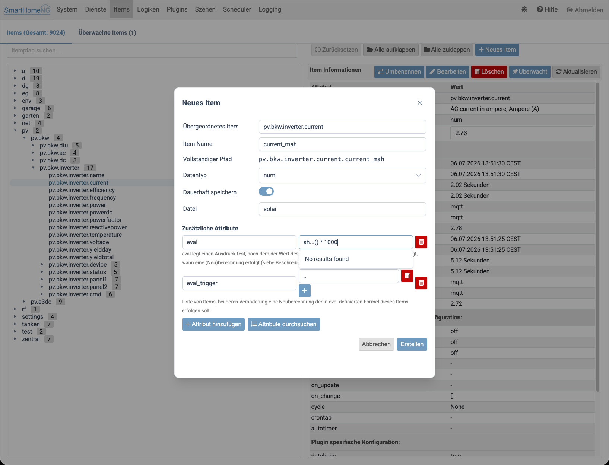
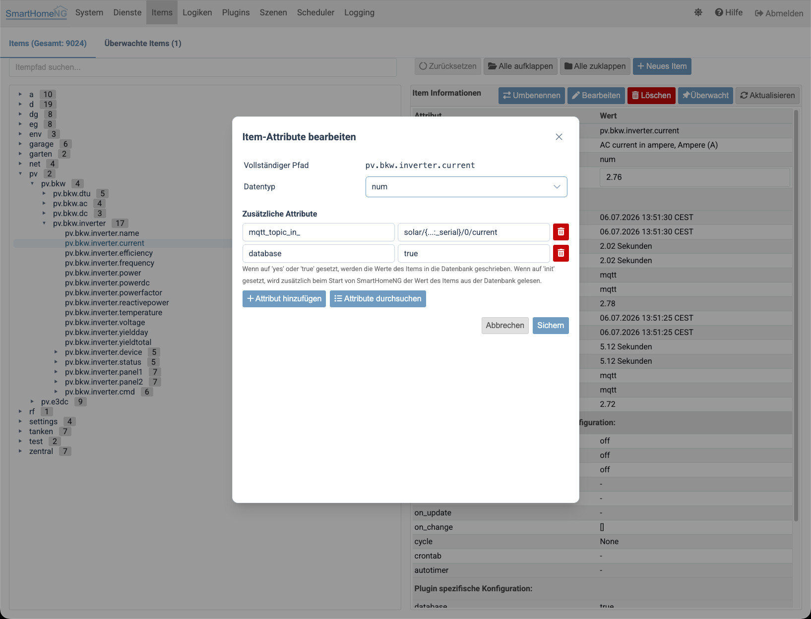
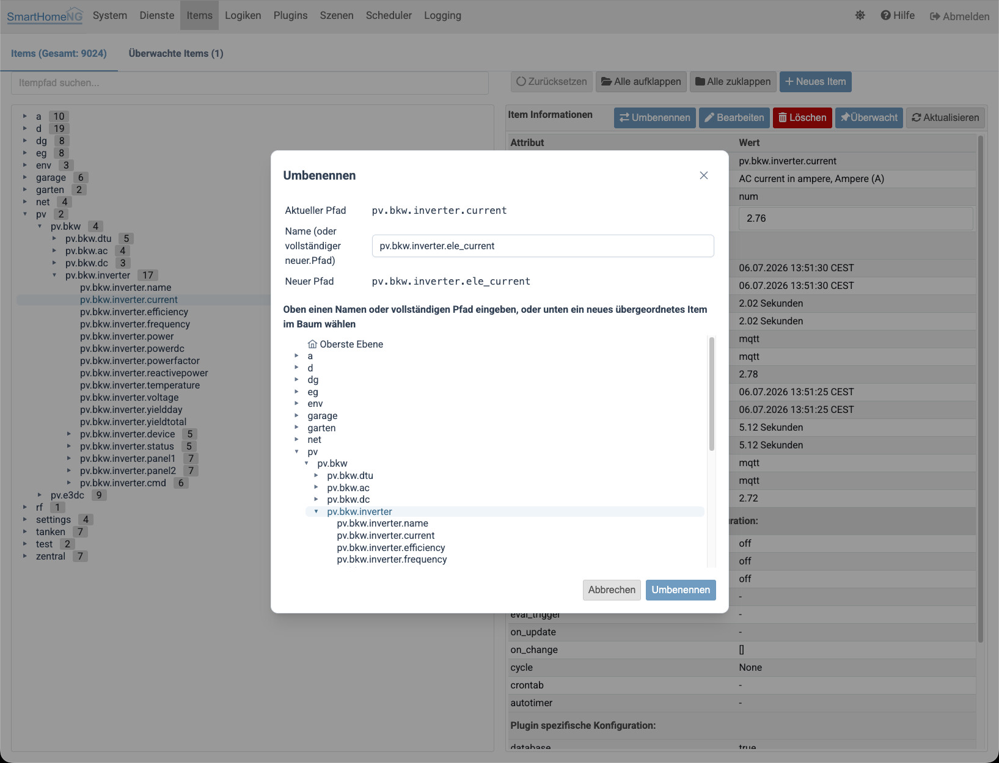
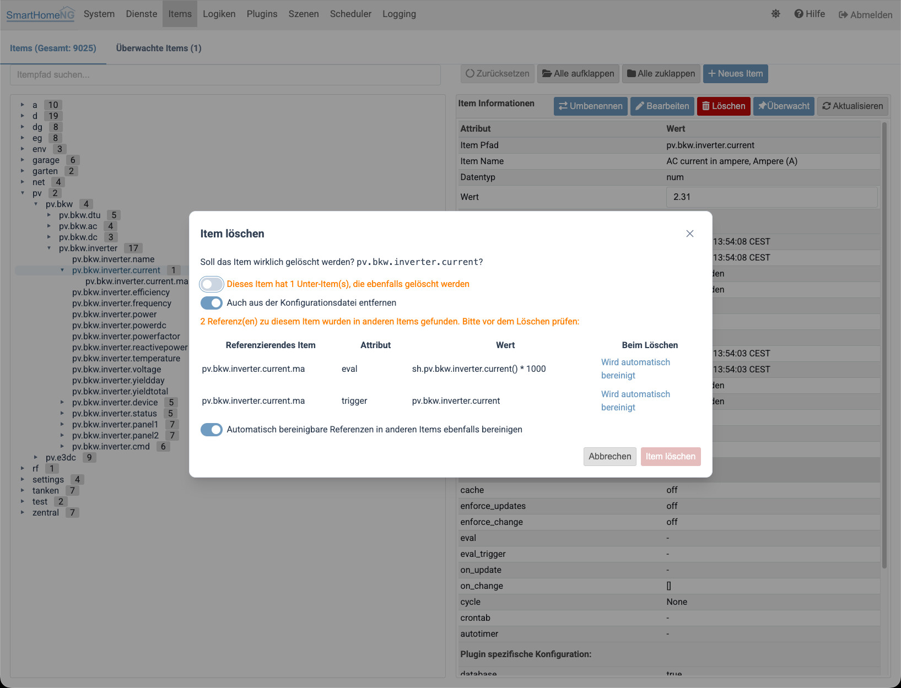
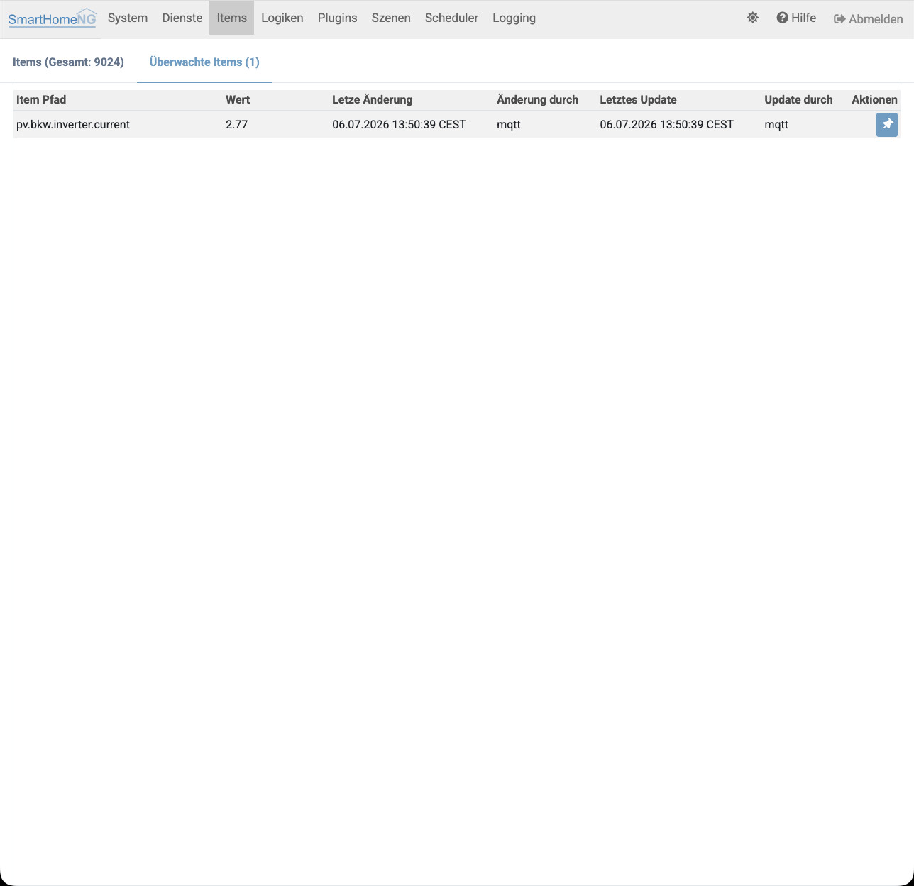
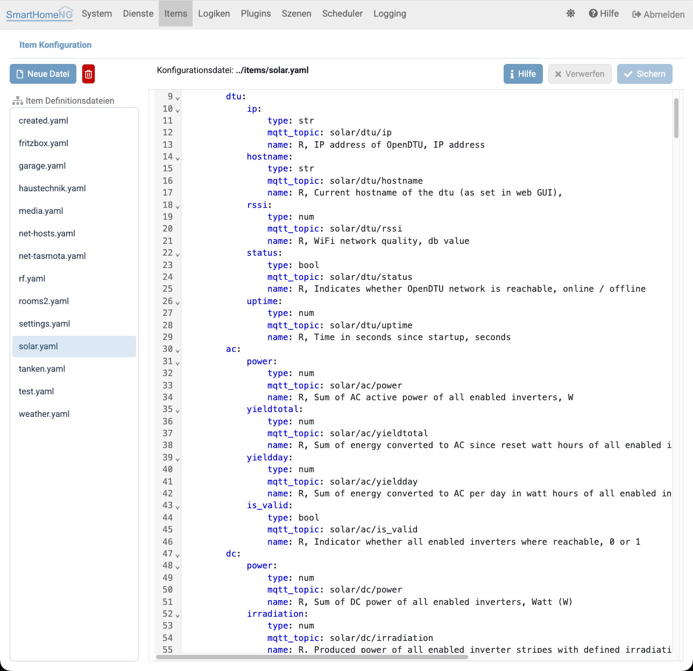
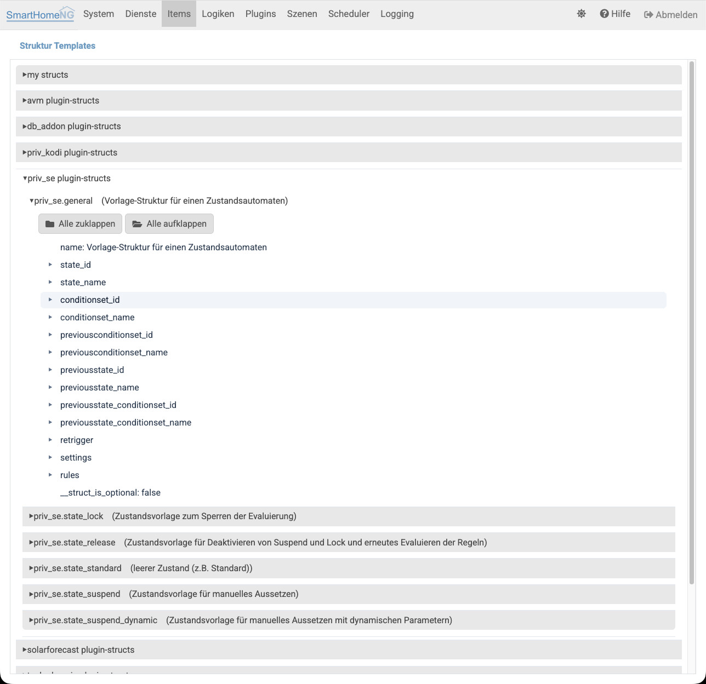
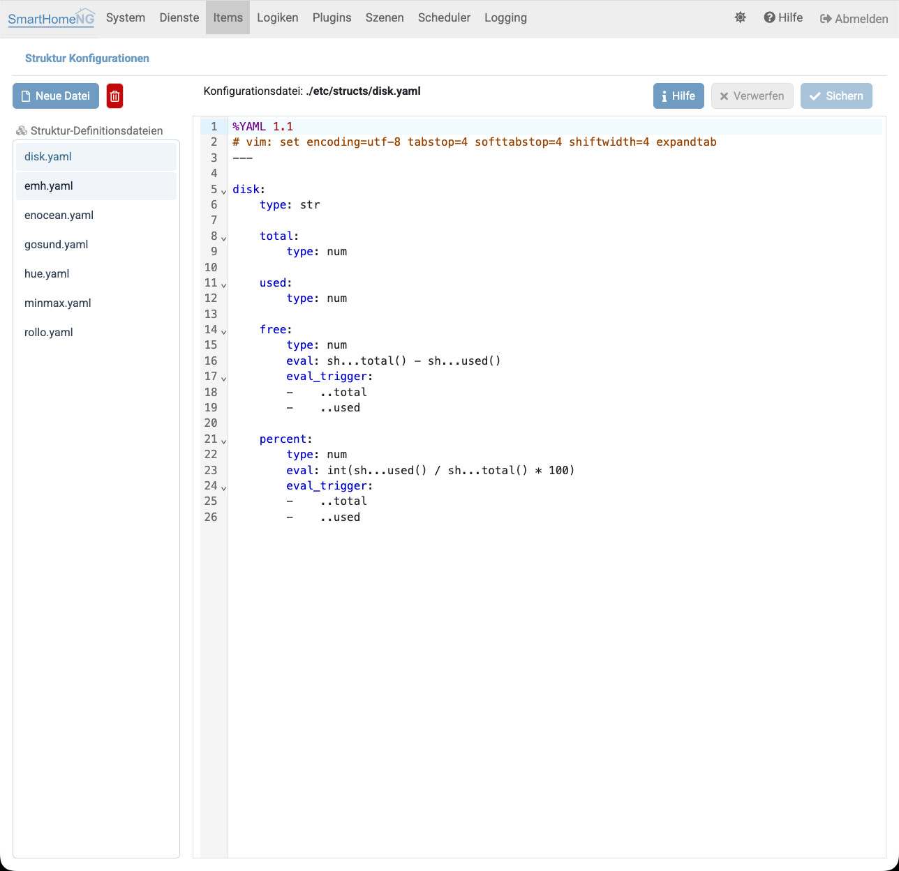

.. index:: Admin GUI; Items
.. index:: Items; Admin GUI

=====
Items
=====

Unter **Items** können die eingelesenen Items und ihre Eigenschaften angezeigt und bearbeitet werden. Außerdem können die zur
Verfügung stehenden Itemstruktur-Templates angezeigt werden.

.. index:: Itemtree
.. index:: Items; Itemtree
.. index:: Items; Item Baum

Item Baum
=========

Hier kann die Baum-Struktur der geladenen Items angezeigt werden. Außerdem können die Eigenschaften und Attribute eines
ausgewählten Items angezeigt und bearbeitet werden.

.. note::

    Die Baum-Struktur zeigt die in SmartHomeNG geladenen Items an. Wenn während der Laufzeit von SmartHomeNG Änderungen
    **an den Item Definitionen in den Konfigurationsdateien** vorgenommen werden, so wird dieses hier bis zu einem Neustart
    von SmartHomeNG nicht sichtbar. Änderungen, die über die hier angebotenen Funktionen erfolgen, sind unmittelbar sichtbar.

Der Item Baum kann die Items mit dem vollen Pfad-Namen oder verkürzt nur mit dem Item Namen (wie im Screenshot oben)
anzeigen. Das gewünschte Verhalten kann unter System/Konfiguration im Tab Admin Modul eingestellt werden. Dort kann
auch eingestellt werden, ab wieviel eingegebenen Zeichen die Suche beginnen soll.

In den rechts angezeigten Item Informationen kann der Wert des Items live angepasst werden.

.. index:: Items; Item erstellen
.. index:: Items; Item bearbeiten
.. index:: Items; Item umbenennen
.. index:: Items; Item löschen

Item erstellen, bearbeiten, umbenennen und löschen
---------------------------------------------------

Über die Buttons oberhalb des Item Baums bzw. in den Item Informationen können Items direkt über die
Admin-Oberfläche angelegt, bearbeitet, umbenannt/verschoben und gelöscht werden.

Item erstellen
~~~~~~~~~~~~~~~

Beim Anlegen eines neuen Items kann ein vollständiger, mehrstufiger Item-Pfad angegeben werden. Fehlende
übergeordnete Items werden dabei automatisch als leere Items angelegt.

Item bearbeiten
~~~~~~~~~~~~~~~~

Der Bearbeiten-Dialog zeigt die vollständige Attribut-Konfiguration des Items zur Bearbeitung an. Beim
Speichern wird die komplette Konfiguration des Items ersetzt: Wird ein zuvor vorhandenes Attribut im Dialog
entfernt, ist es danach nicht mehr vorhanden.

Item umbenennen / verschieben
~~~~~~~~~~~~~~~~~~~~~~~~~~~~~~

Über den Umbenennen-Dialog kann einem Item ein neuer Name und/oder ein neues übergeordnetes Item zugewiesen
werden. Fehlt das gewünschte neue übergeordnete Item, wird vor der Ausführung nachgefragt, ob es (leer)
automatisch angelegt werden soll.

Referenzen auf das umbenannte Item (z.B. in ``trigger`` oder ``eval`` Ausdrücken anderer Items) werden dabei
nach bestem Wissen automatisch angepasst. Da das nicht in jedem Fall zuverlässig möglich ist, werden nicht
angepasste Referenzen nach der Aktion in einer Liste angezeigt, damit sie manuell korrigiert werden können.

Item löschen
~~~~~~~~~~~~

Besitzt ein zu löschendes Item Unter-Items, so wird vor dem Löschen die Anzahl der betroffenen Items im
gesamten Unterbaum angezeigt und eine explizite Bestätigung verlangt.

Referenziert ein anderes Item das zu löschende Item (z.B. über ``trigger`` oder ``eval``), werden diese
Referenzen vor dem Löschen angezeigt. Eindeutig bereinigbare Referenzen (z.B. ``trigger``) werden automatisch
angepasst; bei ``eval``/``on_change``/``on_update`` Ausdrücken, deren Bereinigung den Ausdruck vollständig
entfernen würde, wird der bisherige Ausdruckstext zur Prüfung angezeigt, bevor er verloren geht.

Item Monitoring
---------------

Auf dem Tab **Überwachte Items** können die Item Werte und deren Veränderungen gemonitored werden. Dazu werden vorher
die Items im Item-Tree ausgewählt und mit dem Button **Überwachen** über den Items Details die Überwachung aktiviert
bzw. deaktiviert.

Diese Überwachung kann bei der Entwicklung von Logiken, eval-Ausdrücken oder User-Functions hilfreich sein, da die
Veränderung von Items, welche an völlig unterschiedlichen Stellen im Item-Tree definiert sind, übersichtlich in einer
Tabelle dargestellt wird.

|

Item Konfiguration
==================

Hier können Dateien zur Definition von Items bearbeitet werden. Auf der linken Seite können Item-Konfigurationsdateien
angelegt, gelöscht oder zur Bearbeitung ausgewählt werden.

Eine Dialog-gestützte Bearbeitung einzelner Items steht über den Item Baum zur Verfügung (siehe oben). Diese Seite
dient weiterhin der direkten Bearbeitung ganzer Item-Konfigurationsdateien im YAML Format.

Es können Item Struktur Templates angelegt werden, um sich wiederholende Strukturen einfacher zu verwalten. Item
Strukturen können in Plugins und individuell für die Installation von SmartHomeNG angelegt werden.

Struktur Templates
==================

Hier werden alle zur Verfügung stehenden Struktur Templates angezeigt. Das sind die Struktur Templates die von Plugins
definiert werden, die aktuell in SmartHomeNG konfiguriert sind und die in ``etc/structs.yaml`` konfigurierten Strukturen.
Strukturen aus Plugins sind daran zu erkennen, dass der Name der Item Struktur mit dem Namen des Plugins beginnt, an den
sich mit einem Punkt getrennt der eigentliche Name der Struktur anschließt.

Struktur Konfiguration
======================

Hier können eigene Struktur Templates konfiguriert werden, die in der Datei ``etc/structs.yaml`` gespeichert werden.

.. index:: Struktur Templates
.. index:: Items; Struktur Templates

