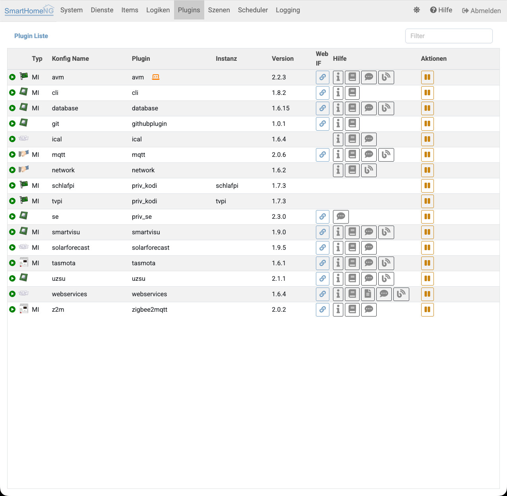
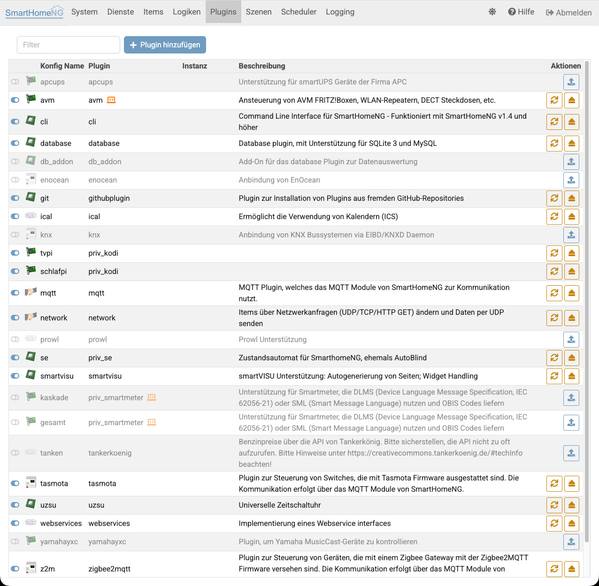
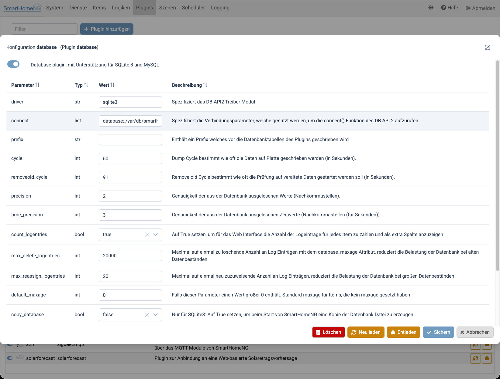

.. index:: Admin GUI; Plugins
.. index:: Plugins; Admin GUI

#######
Plugins
#######

===========================
Liste der geladenen Plugins
===========================

Unter **Plugins** wird eine Liste der geladenen Plugins mit einer Reihe von Informationen zu den Plugins angezeigt.
Rechts in der jeweiligen Zeile sind Icons über die (falls vorhanden)

- das Web Interface des Plugins gestartet werden kann,
- die Konfigurations-Dokumentation zu dem Plugin aufgerufen werden kann,
- die weitergehende Anwender-Dokumentation des Plugins aufgerufen werden kann,
- der Support Thread zu dem Plugin im SmartHomeNG Forum aufgerufen werden kann,
- eine Übersicht über relevante Blog Artikel angezeigt werden kann

.. note::

   Webinterfaces von Plugins können die durch das Admin Interface genutzte Art der Authentifizierung noch nicht
   erkennen/nutzen. Deshalb erscheint beim ersten Aufruf eines Web Interfaces der Basic-Auth Anmeldedialog des Browsers
   und es muss eine Anmeldung mit Username/Passwort des Admin Interfaces erfolgen.

.. index:: Plugins; Aktionen
.. index:: Admin GUI; Plugin Aktionen

Rechts in jeder Zeile findet sich außerdem eine Spalte mit Aktions-Buttons, über die ein bereits geladenes Plugin
gestoppt und wieder gestartet werden kann.

.. index:: Plugin Konfiguration

====================
Plugin Konfiguration
====================

Über diese Funktion können weitere installierte Plugins zur SmartHomeNG Instanz hinzu konfiguriert oder
bestehende Konfigurationen geändert werden. Weiterhin ist es auch möglich Plugins aus der Konfiguration
zu entfernen.

Wenn ein Plugin nur kurzfristig außer Betrieb genommen werden soll, so kann es über einen Schalter deaktiviert
werden. Dadurch kann es später einfach wieder in Betrieb genommen werden, ohne die Konfiguration erneut
durchführen zu müssen. Dies wirkt sich jeweils erst nach dem Neustart des Cores aus.

Liste der konfigurierten Plugins
================================

Die Liste der konfigurierten Plugins zeigt alle Konfigurationen an, die in ``etc/plugin.yaml`` gespeichert sind. Der
Schiebeschalter links in jeder Zeile zeigt ob das Plugin aktiviert ist. Falls nicht, ist es nicht geladen bzw. wird bei
einem Neustart nicht geladen.

Durch anklicken einer Zeile, wird ein Dialog aktiviert um die Konfiguration des jeweiligen Plugins anzupassen.

Falls eine Plugin Konfiguration geändert wird oder eine neue Plugin Konfiguration hinzugefügt wird, wird der Button am
unteren Ende der Liste aktiviert, mit dem SmartHomeNG neu gestartet werden kann um die Änderungen zu aktivieren.

Konfiguration eines Plugins
===========================

Über den Schiebeschalter oben links kann die Plugin Konfiguration aktiviert oder deaktiviert werden. Die Änderung
wird nach einem Neustart von SmartHomeNG aktiv.

Default Werte werden in grau angezeigt. Um zu den Standardwerten zurückzukehren, muss nur der Feldinhalt gelöscht werden,
bzw. bei Auswahl Listen der Wert über das **x** neben dem Wert gelöscht werden.

Falls eine Konfiguration nicht nur deaktiviert, sondern endgültig gelöscht werden soll, so kann das über den
**Löschen** Button erfolgen.

.. note::

   Der obige Screenshot wurde im Entwicklermodus aufgenommen, daher sind zusätzlich die Buttons **Neu laden**
   und **Entladen** sichtbar sowie in der Liste dahinter die entsprechenden Aktions-Icons. Siehe dazu den
   folgenden Abschnitt.

.. index:: Plugins; Laden, Entladen, Neu laden
.. index:: Admin GUI; Plugin laden

Plugin laden, entladen und neu laden
=====================================

Im **Entwicklermodus** (einstellbar unter System/Konfiguration im Tab Admin Modul) stehen sowohl in der Liste der
konfigurierten Plugins als auch im Dialog zur Konfiguration eines Plugins zusätzliche Aktions-Buttons zur Verfügung:

- **Laden**: Lädt ein Plugin, ohne dass SmartHomeNG neu gestartet
  werden muss.
- **Neu laden**: Entlädt ein bereits geladenes Plugin und instanziiert es anschließend neu — z.B. um eine geänderte
  Konfiguration ohne Neustart zu übernehmen. Dabei wird auch ggf. veränderter Code neu geladen.
- **Entladen**: Entfernt die Plugin-Instanz vollständig aus dem Speicher, ohne die Konfiguration selbst zu verändern.

Diese Aktionen greifen tiefer in den Lebenszyklus eines Plugins ein als Start/Stopp in der Plugin-Liste (siehe oben)
und sind deshalb dem Entwicklermodus vorbehalten.

