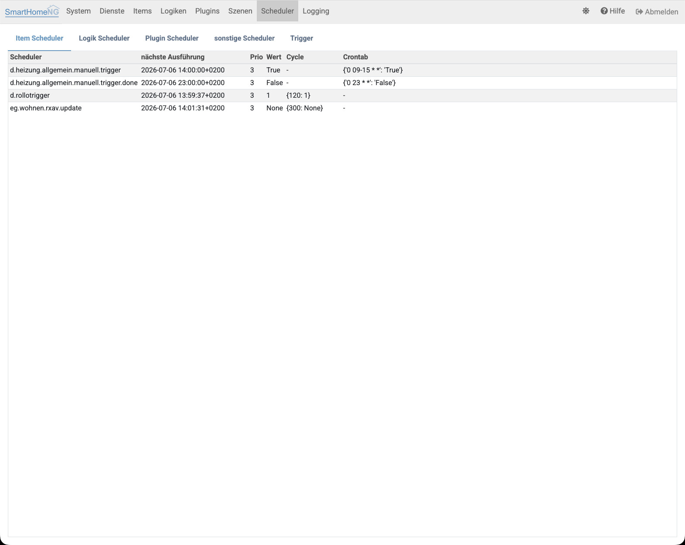
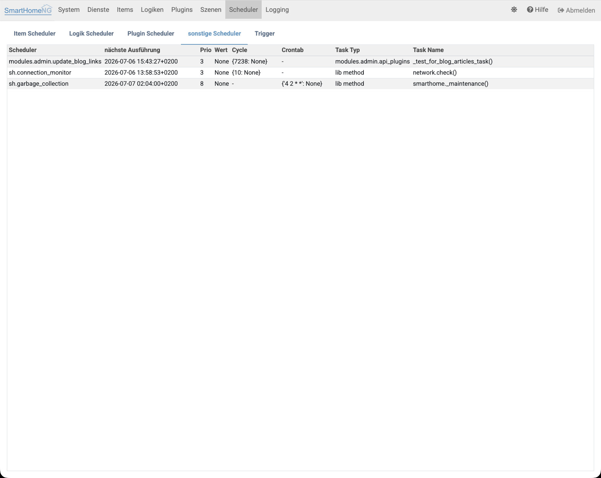

.. index:: Admin GUI; Scheduler
.. index:: Scheduler; Admin GUI

=========
Scheduler
=========

Die Anzeige der Scheduler ist in 5 Tabs unterteilt, wobei für jeden Scheduler der Name, der nächste Ausführungszeitpunkt,
sowie Einstellungen zu Ausführungszyklus und Crontab angezeigt werden.

.. index:: Scheduler; Entwicklermodus

Im **Entwicklermodus** (einstellbar unter System/Konfiguration im Tab Admin Modul) werden zusätzlich die Spalten
**Task-Typ** und **Task-Name** angezeigt, beim Tab für getriggerte Scheduler zusätzlich auch **Ausgelöst durch**.

